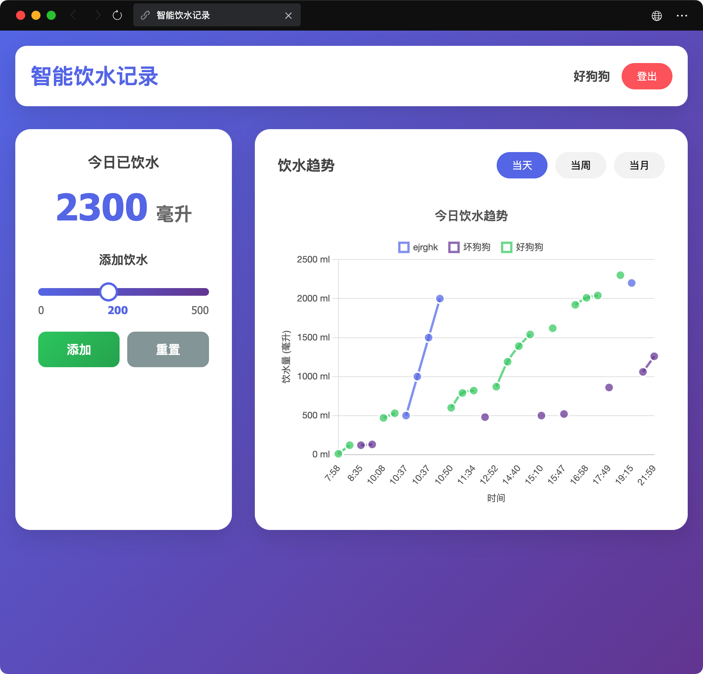

# 饮水记录应用

一个前后端分离的饮水记录应用，用于记录和展示用户的饮水数据。


## 功能特点

- 用户认证系统
- 饮水记录的添加和减少
- 实时数据展示
- 趋势图表（当天、当周、当月）
- 响应式设计，支持移动端

## 技术栈

- 后端：Python (Flask)
- 前端：HTML, CSS, JavaScript
- 数据存储：JSON
- 图表：Chart.js

## 安装和运行

### 后端

```bash
pip install flask flask-cors
python app.py
```

### 前端

直接打开 `http://localhost:8889/static/index.html` 或使用静态文件服务器。
